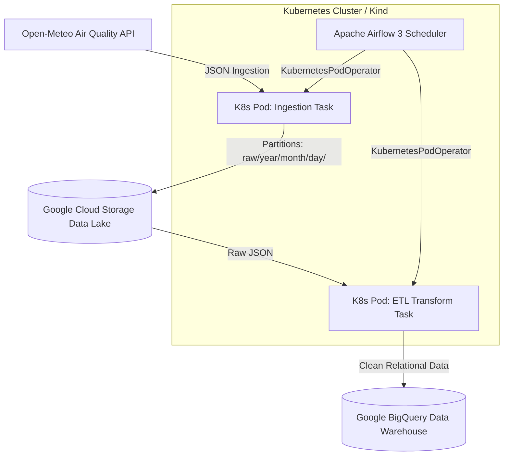

# 🌩️ Cloud & Kubernetes Air Quality ETL Pipeline

An automated Data Engineering pipeline deployed on **Kubernetes (Kind)** using **Apache Airflow 3** and **Google Cloud Platform (GCP)**. It fetches real-time air pollution data for Kraków (PM10, PM2.5, AQI) from the Open-Meteo API, stores raw JSON in **Google Cloud Storage (Data Lake)**, transforms the data using **Python**, and loads relational analytical tables into **Google BigQuery (Data Warehouse)**.

## 🏗️ Architecture

## 🛠️ Tech Stack

- **Cloud Platform:** Google Cloud Platform (GCS Data Lake, BigQuery Data Warehouse)
- **Infrastructure as Code (IaC):** Terraform
- **Containerization & Orchestration:** Docker, Kubernetes (Kind), Helm Charts
- **Workflow Management:** Apache Airflow 3 (KubernetesPodOperator, LocalExecutor)
- **Language & Libraries:** Python 3.10, google-cloud-storage, google-cloud-bigquery

## 🚀 Key Engineering Achievements

- Resolved Kubernetes ephemeral storage constraints and DNS resolution limits in isolated Airflow workers.
- Implemented secure IAM role and credential passing via Kubernetes Secrets (`V1SecretVolumeSource`).
- Automated table schema evolution in BigQuery with `ALLOW_FIELD_ADDITION`.

## 📊 Pipeline Results

### 1. Airflow DAG Execution (KubernetesPodOperator)

### 2. BigQuery Data Warehouse Table

https://datastudio.google.com/reporting/6198380d-531c-417c-a8f5-66cae642bbdc

